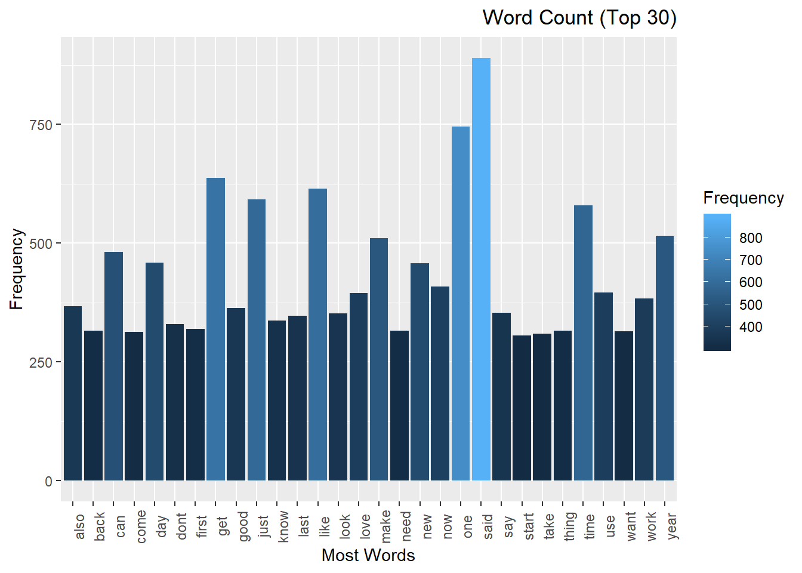

Natural Language Processing: Word Predictor
========================================================
author: Courtney Rowlands
date: 1-Nov-2019
autosize: true

The assignment: Word Prediction
========================================================

The goal of this exercise is to create a product to highlight the prediction algorithm that you have built and to provide an interface that can be accessed by others.

The Algorithm
========================================================
- The main structure for managing documents in tm is a so-called Corpus, representing a collection of text documents. A corpus is an abstract concept, and there can exist several implementations in parallel. 
- A common approach in text mining is to create a term-document matrix from a corpus. In the tm package the classes TermDocumentMatrix and DocumentTermMatrix (depending on whether you want terms as rows and documents as columns, or vice versa) employ sparse matrices for corpora.
- Source: https://cran.r-project.org/web/packages/tm/vignettes/tm.pdf

The Algorithm (cont.)
========================================================

Using the Shiny App
========================================================
- Input a word or string of words.
- Wait for text predictor to make its guess.

Shiny app url:  https://courtney-rowlands.shinyapps.io/WordPredictor/
